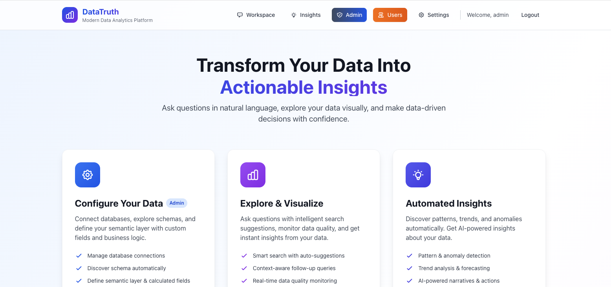
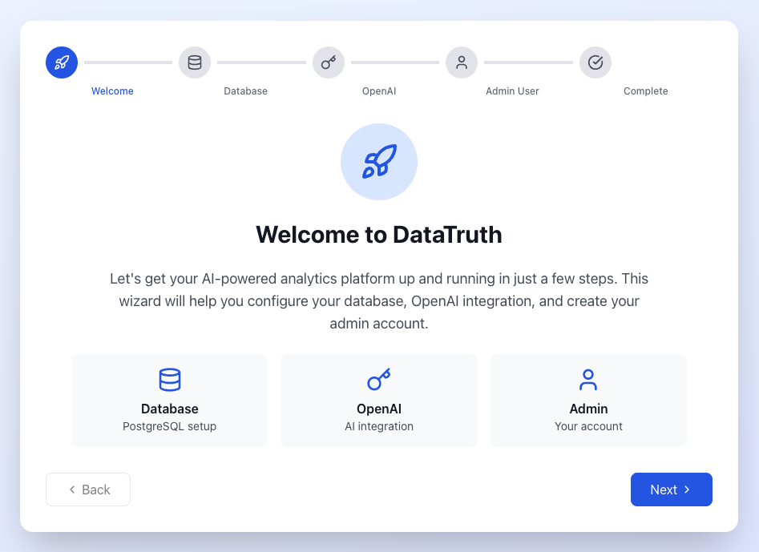
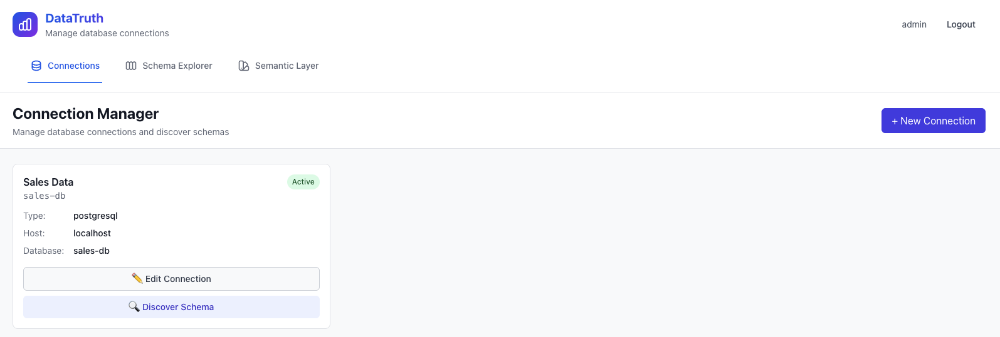
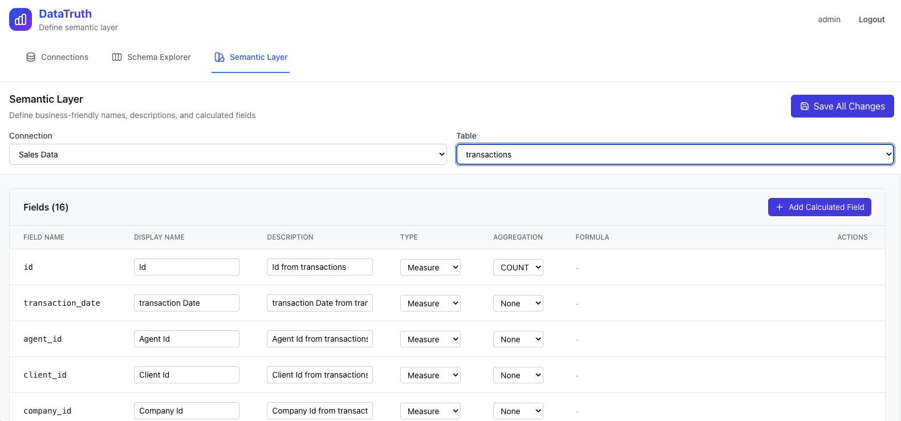

# DataTruth - AI-Powered Analytics SaaS Platform

**Transform your data into insights with natural language queries**

DataTruth is an enterprise-grade analytics platform that enables anyone to query databases using plain English. No SQL knowledge required—just ask questions and get instant, accurate answers with beautiful visualizations.

<p align="center">
  
</p>

---

## 🚀 Quick Start

Get started in under 5 minutes with our one-command deployment:

```bash
# Deploy DataTruth SaaS platform
./deploy-saas.sh

# Open http://localhost:3000
# Complete the guided setup wizard
```

That's it! No configuration files, no manual database setup. Everything is done through our intuitive web interface.



---

## ✨ Why DataTruth?

### 🎯 Built for Everyone
- **Business Users**: Ask questions in plain English, no technical skills needed
- **Analysts**: Get instant insights with AI-powered visualizations
- **Data Teams**: Deploy once, enable your entire organization

### 🔒 Enterprise-Ready
- Role-based access control (Admin, Analyst, Executive, Developer)
- Read-only database access—your data stays safe
- Complete audit trail of all queries and user activities
- SOC 2 compliant architecture

### 🧠 Intelligent & Adaptive
- AI learns your business terminology over time
- Typo-tolerant search with fuzzy matching
- Automatic data quality monitoring
- Smart query suggestions based on your data

### 📊 Beautiful Insights
- Auto-generated charts and visualizations
- Interactive dashboards with drill-down capabilities
- Export to PDF, Excel, or share via link
- Real-time data refresh

---

## 🎬 See It In Action

### Natural Language Queries


### Real-time Chat Interface


### Role-Based Data Insights


### Data Quality Monitoring


---

## 📚 Documentation

- **[Getting Started Guide](docs/README.md)** - Complete setup and configuration
- **[User Guide](docs/USER_MANAGEMENT.md)** - User roles and permissions
- **[Feature Documentation](docs/)** - Detailed feature explanations
- **[Security](docs/SECURITY.md)** - Security architecture and compliance
- **[API Documentation](docs/API.md)** - REST API reference

---

## 🚀 Deployment Options

### Cloud Deployment (Recommended)
```bash
# Deploy to your preferred cloud provider
./deploy-saas.sh --cloud aws|azure|gcp
```

### Self-Hosted
```bash
# Deploy on your own infrastructure
./deploy-saas.sh --self-hosted
```

### Docker Compose
```bash
# Quick local deployment
docker-compose -f docker-compose.saas.yml up -d
```

📖 **[Full Deployment Guide →](docs/SAAS_DEPLOYMENT.md)**

---

## 🎯 Key Features

### For Business Users
- **Natural Language Queries**: "Show me top 10 customers by revenue last quarter"
- **Smart Suggestions**: AI recommends relevant queries based on your data
- **Interactive Charts**: Automatic visualization with drill-down capabilities
- **Export Anywhere**: PDF, Excel, CSV—share insights easily

### For Data Teams
- **Semantic Layer**: Define metrics once, use everywhere
- **Data Quality Monitoring**: 6-dimensional quality scoring (freshness, completeness, accuracy, consistency, validity, uniqueness)
- **Fuzzy Matching**: Typo-tolerant search handles "revenu", "kalifornia", "tot sal"
- **Complete Audit Trail**: Track every query, user action, and data access

### For IT & Security
- **Read-Only Access**: Database connections are strictly read-only
- **SQL Injection Prevention**: AI-generated queries validated and sandboxed
- **Role-Based Access Control**: Admin, Analyst, Executive, Developer roles
- **Activity Monitoring**: Real-time tracking of all user activities
- **Compliance Ready**: Complete data lineage and audit logs

---

## 🏢 Use Cases

### Sales Analytics
"Show me the top performing sales reps this quarter with their conversion rates"

### Customer Insights
"Which customers have decreased their spending by more than 20% in the last 6 months?"

### Financial Reporting
"Calculate profit margin by product category for each region"

### Operations
"Show me average delivery time by carrier and identify outliers"

---

## 🛠️ Technology Stack

- **Backend**: Python FastAPI with async support
- **Database**: PostgreSQL with vector extensions
- **AI/ML**: OpenAI GPT-4, ChromaDB for semantic search
- **Frontend**: React with TypeScript, TailwindCSS
- **Infrastructure**: Docker, Nginx, Redis
- **Security**: JWT authentication, rate limiting, SQL guardrails

---

## 📊 Enterprise Features

### User Management


Comprehensive user administration with:
- Multiple authentication methods (email/password, SSO)
- Granular role assignments
- Activity tracking and analytics
- Bulk user operations

### Connection Management


Connect to any database:
- PostgreSQL, MySQL, Snowflake, BigQuery
- Auto schema discovery
- Connection testing and validation
- Secure credential storage

### Semantic Layer


Define business metrics once:
- Calculated metrics and KPIs
- Business-friendly field names
- Cross-database field mapping
- AI-generated descriptions

---

## 🔒 Security & Compliance

DataTruth implements enterprise-grade security:

✅ **Data Protection**
- Encryption at rest and in transit
- Read-only database connections
- No data stored outside your infrastructure

✅ **Access Control**
- Multi-factor authentication (MFA)
- Role-based permissions
- IP allowlisting
- Session management

✅ **Audit & Compliance**
- Complete query audit trail
- User activity logging
- Data access monitoring
- SOC 2 compliance ready

📖 **[Full Security Documentation →](docs/SECURITY.md)**

---

## 🚦 Getting Help

### Documentation
- [User Guide](docs/USER_MANAGEMENT.md) - Learn how to use DataTruth
- [Admin Guide](docs/SAAS_DEPLOYMENT.md) - Platform administration
- [API Reference](docs/API.md) - Integration documentation

### Support
- 📧 Email: support@datatruth.ai
- 💬 Community: [Discord](https://discord.gg/datatruth)
- 📝 Issues: [GitHub Issues](https://github.com/yourusername/datatruth/issues)

---

## 📈 Roadmap

### Q1 2025
- ✅ SaaS deployment mode
- ✅ Web-based setup wizard
- ✅ Role-based access control
- ✅ Data quality monitoring

### Q2 2025
- 🔄 Advanced visualizations (geographic maps, sankey diagrams)
- 🔄 Scheduled reports and alerts
- 🔄 Slack/Teams integration
- 🔄 Custom dashboards

### Q3 2025
- 📅 Snowflake and BigQuery connectors
- 📅 dbt integration
- 📅 Advanced ML predictions
- 📅 Mobile app (iOS/Android)

---

## 🤝 Contributing

We welcome contributions! Please see our [Contributing Guide](CONTRIBUTING.md) for details.

```bash
# Fork the repository
# Create a feature branch
git checkout -b feature/amazing-feature

# Make your changes and test
pytest

# Submit a pull request
```

---

## 📄 License

DataTruth is licensed under the MIT License. See [LICENSE](LICENSE) for details.

---

## 🙏 Acknowledgments

Built with amazing open-source technologies:
- [FastAPI](https://fastapi.tiangolo.com/) - Modern Python web framework
- [React](https://react.dev/) - UI framework
- [PostgreSQL](https://www.postgresql.org/) - World's most advanced open source database
- [OpenAI](https://openai.com/) - AI language models
- [ChromaDB](https://www.trychroma.com/) - Vector database

---

<p align="center">
  <strong>Ready to transform your data into insights?</strong><br/>
  <a href="docs/SAAS_DEPLOYMENT.md">Get Started →</a>
</p>
