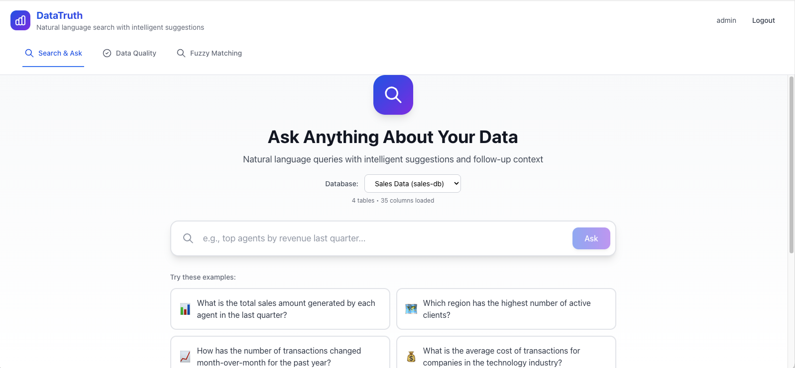
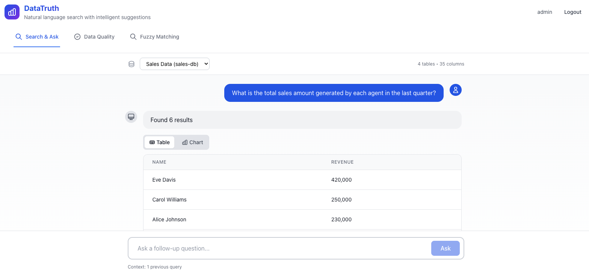
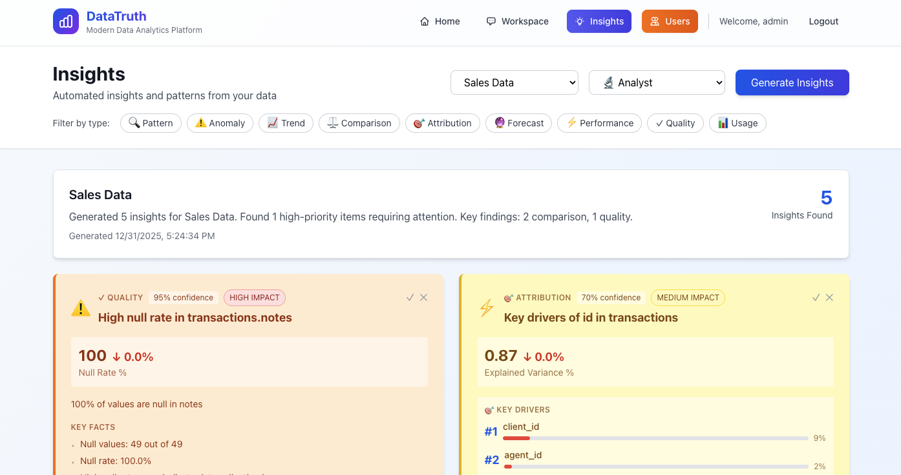
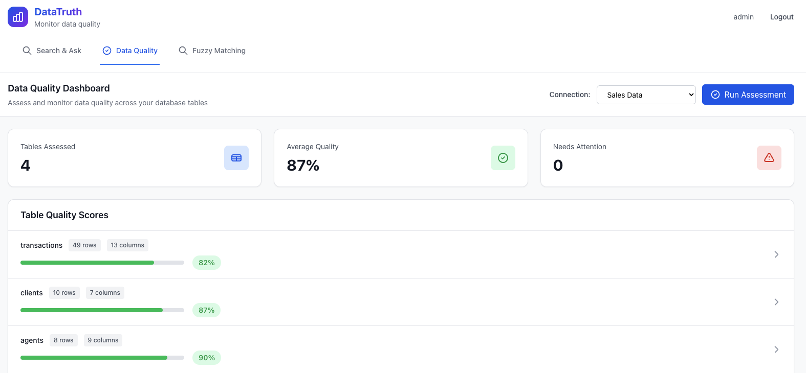
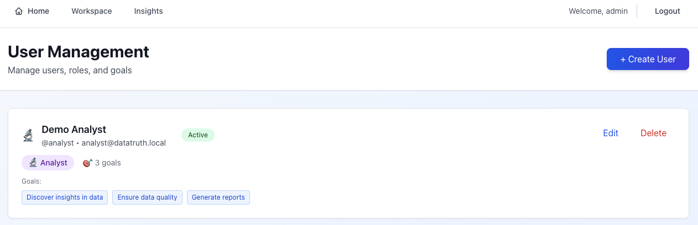

# DataTruth Documentation

Welcome to DataTruth—the AI-powered analytics platform that transforms how your organization works with data.

---

## 🚀 Quick Start

### New Users? Start Here!

1. **[SaaS Deployment Guide](SAAS_DEPLOYMENT.md)** - Deploy DataTruth in 5 minutes
2. **[Setup Wizard Guide](SAAS_TRANSFORMATION.md)** - Complete the web-based setup
3. **[User Management](USER_MANAGEMENT.md)** - Create accounts and assign roles

---

## 📚 Documentation by Role

### For Administrators

**Getting Started**
- [SaaS Deployment](SAAS_DEPLOYMENT.md) - One-command deployment
- [User Management](USER_MANAGEMENT.md) - Create and manage users
- [Security Guide](SECURITY.md) - Security best practices

**Advanced Configuration**
- [Database Connections](DATABASE_CHOICE_FEATURE.md) - Connect your databases
- [Navigation Guide](NAVIGATION_GUIDE.md) - Platform navigation overview

### For Business Users

**Core Features**
- [Search and Ask](SEARCH_AND_ASK_FEATURE.md) - Query your data in natural language
- [Data Insights](INSIGHTS_IMPLEMENTATION.md) - AI-powered insights and recommendations
- [Chart Visualization](CHART_VISUALIZATION.md) - Interactive charts and dashboards
- [Intelligent Suggestions](INTELLIGENT_SUGGESTIONS.md) - Smart query recommendations

**Advanced Features**
- [Calculated Metrics](CALCULATED_METRICS_UI.md) - Create custom business metrics
- [Semantic Layer](SEMANTIC_LAYER.md) - Define business terminology and KPIs
- [Learning Agent](LEARNING_AGENT.md) - How DataTruth learns from your usage

### For Data Teams & Developers

**Technical Documentation**
- [System Architecture](ARCHITECTURE.md) - Complete system architecture and technical design
- [REST API Reference](API.md) - Complete API documentation with examples
- [Vector Database](VECTOR_DB_IMPLEMENTATION.md) - Semantic search architecture
- [User Activity Tracking](USER_ACTIVITY_TRACKING.md) - Analytics and monitoring
- [Security Architecture](SECURITY.md) - Security implementation details

---

## 🎯 Feature Overview

### Natural Language Analytics
Ask questions like "Show me top 10 customers by revenue last quarter" and get instant, accurate answers with beautiful visualizations.

### Real-Time Chat Interface
Interactive chat-based query interface with:
- Smart autocomplete and suggestions
- Query history and favorites
- Export results to Excel/PDF
- Share insights with your team

### Role-Based Data Access
Different views optimized for each role:
- **Executives**: High-level dashboards and KPIs
- **Analysts**: Deep-dive analytics and custom metrics
- **Developers**: Technical metrics and system insights

### Data Quality Monitoring
Automatic monitoring of 6 quality dimensions:
- Freshness - How recent is the data?
- Completeness - Are there missing values?
- Accuracy - Does the data make sense?
- Consistency - Are values uniform?
- Validity - Do values follow rules?
- Uniqueness - Are there duplicates?

### Enterprise Administration
Complete user and system management:
- User creation and role assignment
- Database connection management
- Activity monitoring and audit logs
- System health and performance

---

## 📖 Detailed Documentation

### Setup & Configuration
- **[SAAS_DEPLOYMENT.md](SAAS_DEPLOYMENT.md)** - Complete deployment guide
- **[SAAS_TRANSFORMATION.md](SAAS_TRANSFORMATION.md)** - What's new in the SaaS version
- **[DATABASE_CHOICE_FEATURE.md](DATABASE_CHOICE_FEATURE.md)** - Configure database connections

### Features & Usage
- **[SEARCH_AND_ASK_FEATURE.md](SEARCH_AND_ASK_FEATURE.md)** - Natural language queries
- **[CHART_VISUALIZATION.md](CHART_VISUALIZATION.md)** - Data visualization
- **[INSIGHTS_IMPLEMENTATION.md](INSIGHTS_IMPLEMENTATION.md)** - AI-powered insights
- **[INTELLIGENT_SUGGESTIONS.md](INTELLIGENT_SUGGESTIONS.md)** - Smart suggestions
- **[CALCULATED_METRICS_UI.md](CALCULATED_METRICS_UI.md)** - Custom metrics
- **[SEMANTIC_LAYER.md](SEMANTIC_LAYER.md)** - Business terminology layer
- **[LEARNING_AGENT.md](LEARNING_AGENT.md)** - Adaptive learning system

### Administration & Security
- **[USER_MANAGEMENT.md](USER_MANAGEMENT.md)** - User administration
- **[USER_ACTIVITY_TRACKING.md](USER_ACTIVITY_TRACKING.md)** - Activity monitoring
- **[SECURITY.md](SECURITY.md)** - Security & compliance
- **[NAVIGATION_GUIDE.md](NAVIGATION_GUIDE.md)** - Platform navigation

### Technical Details
- **[VECTOR_DB_IMPLEMENTATION.md](VECTOR_DB_IMPLEMENTATION.md)** - Vector database architecture
- **[vector-db.md](vector-db.md)** - Additional technical details

---

## 🎬 Video Tutorials

Coming soon! Subscribe to our [YouTube channel](https://youtube.com/datatruth) for video tutorials.

---

## 💡 Common Use Cases

### Sales Analytics
- "Show top performing sales reps by region"
- "Calculate conversion rates for each product category"
- "Compare this quarter's revenue to last quarter"

### Customer Intelligence
- "Which customers decreased spending by more than 20%?"
- "Show customer retention rate by cohort"
- "Find high-value customers at risk of churning"

### Financial Reporting
- "Calculate profit margin by product and region"
- "Show year-over-year revenue growth"
- "Generate monthly P&L summary"

### Operations & Logistics
- "Show average delivery time by carrier"
- "Identify bottlenecks in the supply chain"
- "Calculate inventory turnover by warehouse"

---

## 🆘 Getting Help

### Documentation Issues
Found a problem with the documentation? [Open an issue](https://github.com/yourusername/datatruth/issues)

### Feature Requests
Have an idea for a new feature? [Submit a request](https://github.com/yourusername/datatruth/issues/new?template=feature_request.md)

### Technical Support
- 📧 Email: support@datatruth.ai
- 💬 Community: [Discord](https://discord.gg/datatruth)
- 📝 Knowledge Base: [help.datatruth.ai](https://help.datatruth.ai)

---

## 📈 What's Next?

After getting started with DataTruth, explore these advanced features:

1. **Create Custom Metrics** - Define your own KPIs and calculations
2. **Set Up Alerts** - Get notified when metrics cross thresholds
3. **Build Dashboards** - Create role-specific views for your team
4. **Integrate APIs** - Connect DataTruth to your workflows

---

  <strong>Ready to get started?</strong> 
  <a href="SAAS_DEPLOYMENT.md">Deploy DataTruth Now →</a>

